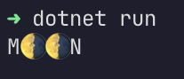

# MoonLoader
A terminal spinner/loader using the moon emoji 🌖


### Install

> [NuGet](https://www.nuget.org/packages/H3rm.MoonLoader/)
>```bash
>dotnet add package H3rm.MoonLoader
>```

### Usage

For basic usage, create a new instance of the loader and call `loader.Spin()` in a loop.\
This will print a spinning 🌖 in the console.
```csharp
using H3rm.MoonLoader.Core;

var loader = new MoonLoader();

int i = 0;
while (i < 20)
{
    loader.Spin();
    i++;
}

loader.Dispose();
```

The `Spin()` method takes a `params object?[]`parameter that can be used to modify the output.

```csharp
loader.Spin("Hello Moon!");
// Output: Hello Moon!🌖
```
Use the `{moon}` tag to place a moon somewhere.

> ```csharp
> loader.Spin("M{moon}{moon}N");
> // Output: M🌖🌖N
> ```
> 

The loader can also be retrieved as a string.
```csharp
var loader = new MoonLoader();

int i = 0;
while (i < 20)
{
    Console.Write(loader.Moon);
    i++;
}

loader.Dispose();
```

#### IDisposable
Make sure to call `loader.Dispose()` when it's not used anymore.

#### Options
Configure the loader with the `MoonLoaderOptions` parameter.

```csharp
var options = new MoonLoaderOptions
{
    Delay = TimeSpan.FromMilliseconds(100),
    HideCursor = true
};

var loader = new MoonLoader(options);
```